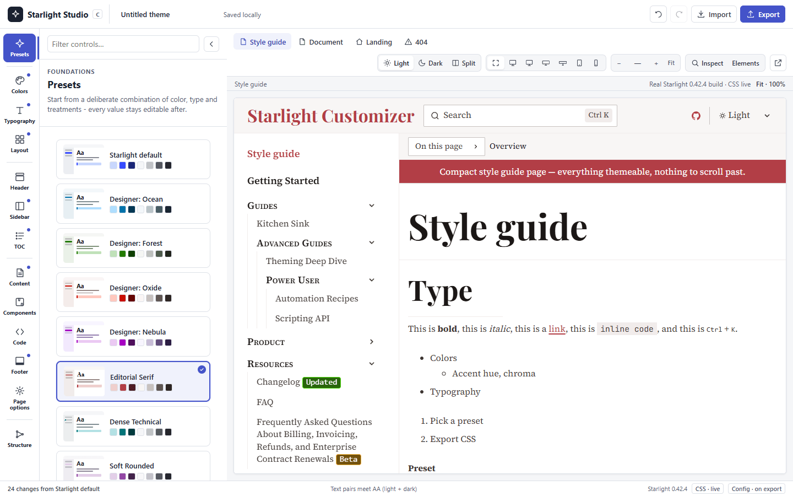

# Starlight Visual Customizer

A visual theme customizer for [Astro Starlight](https://starlight.astro.build/) docs sites. It
previews your real Starlight pages live - in an actual iframe, with your real content, not a
mockup - while you adjust colors, typography, layout, and component styles, then exports a
`theme.css` and an `APPLY-THEME.md` you drop into your own Starlight project.



## Quick start

```bash
cd app
npm install
npm run build
npm run preview:bg   # serves dist/ in the background on http://localhost:4420
```

Open <http://localhost:4420/studio/> - the studio, showing a demo Starlight site's style guide
page. Pick a preset, adjust colors/typography/layout, then open **Export** to get `theme.css`,
`APPLY-THEME.md`, and a share link.

See [`app/README.md`](app/README.md) for the full developer README: every part of the studio UI,
running the dev server, and the test suites.

## How an export is applied

`APPLY-THEME.md` is a generated, deterministic set of steps for your own Starlight site:

1. Copy the exported `theme.css` into `src/styles/` in your project.
2. In `astro.config.mjs`, add (or append to) a `customCss` array entry pointing at that file, as
   the **last** entry - this theme's CSS is intentionally unlayered, so array order decides any
   tie with another stylesheet on the same selector, and adding it last is what makes it win.
3. If you picked a non-default web font, `npm install` the matching `@fontsource-variable/<font>`
   package(s) it lists.
4. Rebuild.

A dedicated round-trip test (`app/tests/roundtrip`) applies a real export to a freshly-scaffolded
Starlight site and diffs it against the studio's own live preview, so this promise is checked, not
just documented.

## Serving under a sub-path

The app builds and runs at `/` by default. It can also be served under a sub-path - for example a
GitHub Pages project site at `https://<user>.github.io/<repo>/` - by setting one build-time
environment variable, `SVC_SITE_BASE`, before `astro build`/`astro preview`. Every internal link
the customizer builds (page tabs, frame navigation, the sidebar) goes through one base-path helper,
so nothing else needs to change. See ["Serving under a sub-path"](app/README.md#serving-under-a-sub-path)
in the app README for the exact commands.

## Tests

| Suite | What it checks |
|---|---|
| `npm test` (193 unit tests) | The CSS/`APPLY-THEME.md` emitters, manifest, state, color math, sidebar-IA parser, undo/redo stack, and base-path helper - no browser needed |
| `npm run test:e2e` (10 browser suites, 869 checks) | Every control's visual effect and target selector, the studio shell (rail, panel, contrast, undo/redo), Inspect, hex color entry, the structure editor, and PNG screenshot export - against a real running preview |
| `npm run test:roundtrip` | Applies a real export to a freshly-scaffolded Starlight site and diffs computed styles against the studio's live preview, proving the export/preview promise holds outside the studio |

Full suite-by-suite breakdown, ports, and commands: [`app/README.md`](app/README.md#tests).

## Privacy

Your theme never leaves your browser: everything - the state, the preview, the export - runs and
stays client-side (`localStorage` and, if you use it, a URL-encoded share link). The only network
requests the studio makes on its own are to `cdn.jsdelivr.net` (Fontsource), to load the variable
web fonts you preview or select - see [`THIRD-PARTY-NOTICES.md`](THIRD-PARTY-NOTICES.md) for the
full list and their licenses.

## License

[MIT](LICENSE). Third-party licenses and attributions: [`THIRD-PARTY-NOTICES.md`](THIRD-PARTY-NOTICES.md).
