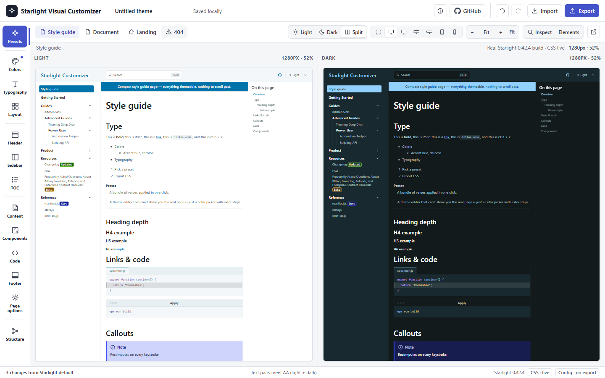
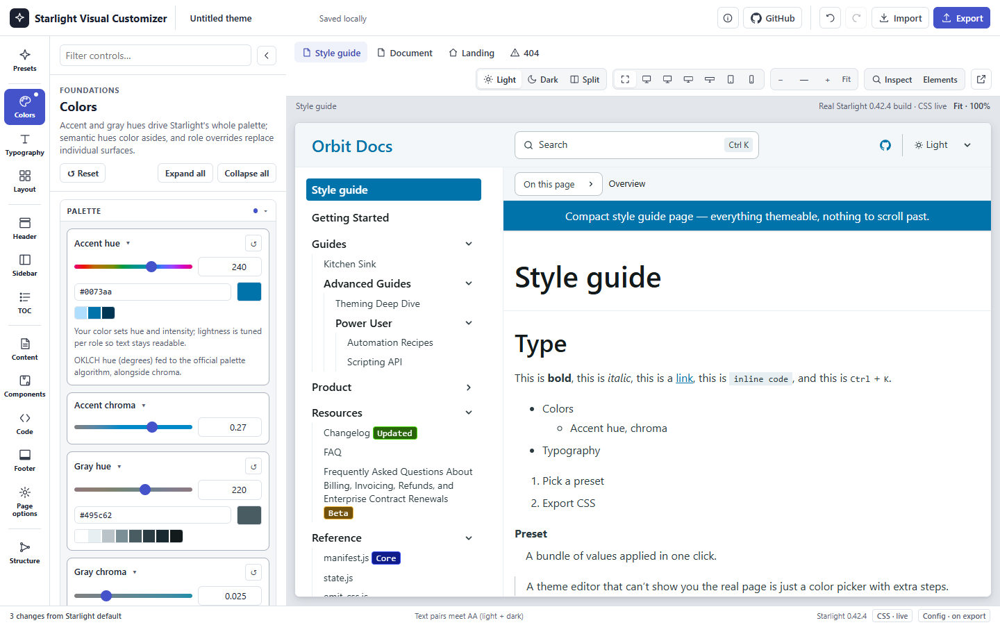
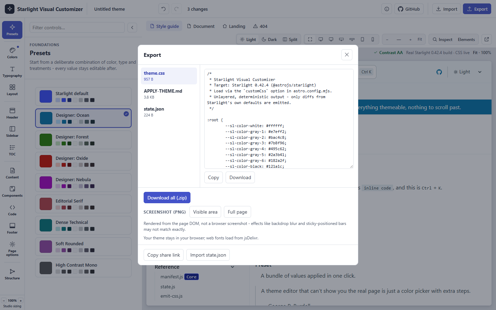
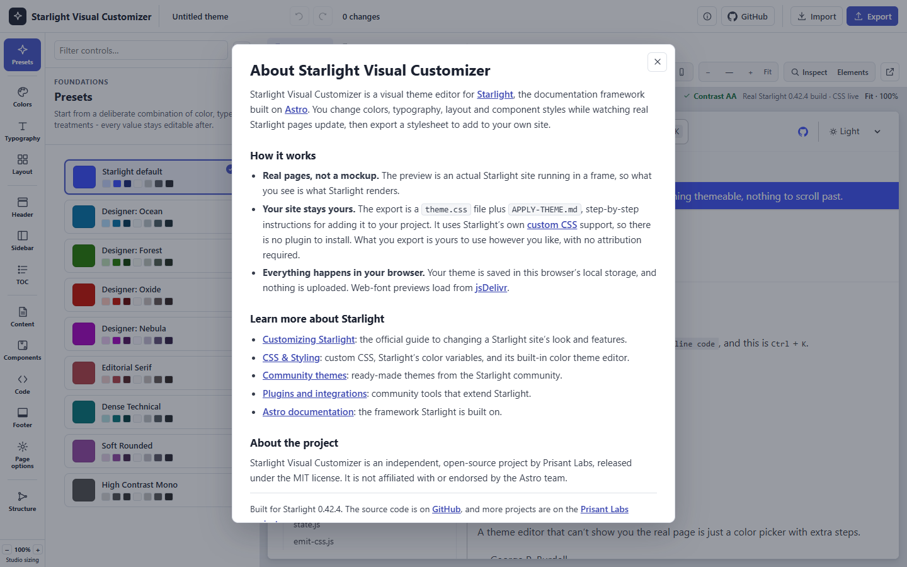

# Starlight Visual Customizer

**A free visual theme editor for [Starlight](https://starlight.astro.build/). Restyle colors,
fonts, layout and components on real Starlight pages, then export one CSS file.**

[](https://projects.prisantlabs.com/starlight-visual-customizer/studio/)
[](https://github.com/prisant-labs/starlight-visual-customizer/releases)
[](LICENSE)
[](https://starlight.astro.build/)
[](https://astro.build/)

[](https://projects.prisantlabs.com/starlight-visual-customizer/studio/)

Starlight Visual Customizer is an independent, open-source project by Prisant Labs, released
under the MIT license. It is not affiliated with or endorsed by the Astro team.

Starlight's built-in color theme editor sets an accent color and a gray. This editor covers
typography, layout and component styles too. Every change appears at once on real Starlight
pages, in light mode and dark mode.

## What you can do

- **Start from a preset.** Nine presets range from Starlight's own default to Editorial Serif and
  High Contrast Mono. Every value stays editable after you pick one.
- **Change the whole look, not just the palette.** Colors, fonts, the type scale, the content
  width, the header, the sidebar, the table of contents, callouts, cards, tables, tabs, code
  blocks and the footer each have their own controls.
- **See your theme on real pages.** The preview is an actual Starlight build in a frame, not a
  mockup. Switch between a style guide, a long document, a landing page and the 404 page.
- **Check light and dark together.** Split view shows both modes side by side. The contrast check
  above the preview reports whether text color pairs meet WCAG AA contrast in both modes.
- **Find the control for any element.** Turn on Inspect, then click an element on the page to
  open the controls that style it.
- **Preview at real sizes.** Device widths run from a 390-pixel phone to a 2560-pixel ultra-wide
  screen.
- **Undo anything, and share the result.** Every change is one undo step. A share link carries
  the whole theme and the page you were viewing in its URL. Opening one never silently replaces
  a theme you saved: the studio asks first.

<table>
  <tr>
    <td width="50%"></td>
    <td width="50%"></td>
  </tr>
  <tr>
    <td><b>Light and dark, side by side.</b> Split view renders the page in both modes from one theme.</td>
    <td><b>Colors that stay readable.</b> Pick a hue or type a hex value; Starlight's palette algorithm tunes lightness per role.</td>
  </tr>
  <tr>
    <td></td>
    <td></td>
  </tr>
  <tr>
    <td><b>Export in one click.</b> Copy or download each file, or get all three in a zip.</td>
    <td><b>About the project.</b> What the studio does and where to learn more about Starlight.</td>
  </tr>
</table>

## How export works

Export gives you three files. The theme uses Starlight's own `customCss` option, so there is no
plugin to install.

| File | What it holds |
|---|---|
| `theme.css` | Only the values that differ from Starlight's defaults, as plain unlayered CSS |
| `APPLY-THEME.md` | Numbered steps for adding the theme to your project, which a coding agent can follow too |
| `state.json` | The theme's settings, so you can import it later and keep editing |

`APPLY-THEME.md` is generated for each theme, and its steps are the same every time:

1. Copy the exported `theme.css` into `src/styles/` in your project.
2. In `astro.config.mjs`, add that file as the **last** entry of Starlight's `customCss` array.
   The theme's CSS is unlayered, so the last entry wins any tie with another stylesheet.
3. If you picked a non-default web font, `npm install` each `@fontsource-variable/<font>`
   package the file lists.
4. Rebuild.

A round-trip test checks this promise. It applies a real export to a freshly scaffolded Starlight
site, then compares the computed styles with the studio's own live preview.

## Privacy

Your theme never leaves your browser. The state, the preview and the export all run and stay on
the client, in `localStorage` and, if you use one, a share link. The studio makes only one kind of
network request on its own: it loads the variable web fonts you preview from `cdn.jsdelivr.net`
(Fontsource). [`THIRD-PARTY-NOTICES.md`](THIRD-PARTY-NOTICES.md) lists every dependency and its
license.

## Run it locally

You need Node 22.

```bash
cd app
npm install
npm run build
npm run preview:bg   # serves dist/ in the background on http://localhost:4420
```

Open <http://localhost:4420/studio/>. The studio opens on the demo site's style guide page. Pick
a preset, adjust the controls, then open **Export**.

[`app/README.md`](app/README.md) is the full developer guide. It covers every part of the studio,
the dev server, serving under a sub-path, and the test suites.

### Serving under a sub-path

The app builds for `/` by default. To serve it under a sub-path, such as a GitHub Pages project
site at `https://<user>.github.io/<repo>/`, set `SVC_SITE_BASE` before `astro build` and
`astro preview`. Every internal link goes through one base-path helper, so nothing else changes.
See ["Serving under a sub-path"](app/README.md#serving-under-a-sub-path) for the exact commands.

## Tests

| Suite | What it checks |
|---|---|
| `npm test` (242 unit tests) | The CSS and `APPLY-THEME.md` emitters, the manifest, state, share-link decoding and sidebar-link safety, color math, the sidebar parser, undo and redo, and the base-path helper. No browser needed. |
| `npm run test:e2e` (13 browser suites) | The product page, every control's visual effect and target, the studio shell, Studio sizing, share links, Inspect, hex color entry, the structure editor and PNG screenshot export, against a running preview |
| `npm run test:roundtrip` | Applies a real export to a freshly scaffolded Starlight site and compares its computed styles with the studio's live preview |

Every pull request runs the unit tests and a production build in CI. The suite-by-suite
breakdown, ports and commands are in [`app/README.md`](app/README.md#tests).

## Built with

[Astro](https://astro.build/) and [Starlight](https://starlight.astro.build/), with
[culori](https://github.com/Evercoder/culori) for color math, [vanilla-colorful](https://github.com/web-padawan/vanilla-colorful)
for the color picker, [fflate](https://github.com/101arrowz/fflate) for the zip download and
[modern-screenshot](https://github.com/qq15725/modern-screenshot) for PNG export.

## Contributing

Bug reports, ideas and themes are welcome. Report a bug under
[Issues](https://github.com/prisant-labs/starlight-visual-customizer/issues/new/choose), and bring
questions and ideas to
[Discussions](https://github.com/prisant-labs/starlight-visual-customizer/discussions). To share a
theme, post its share link in Show and tell. [`CONTRIBUTING.md`](CONTRIBUTING.md) explains how to
run the app and its tests. [`SECURITY.md`](SECURITY.md) explains how to report a vulnerability
privately.

## Releases

Each release is tagged, and its notes are on the
[Releases page](https://github.com/prisant-labs/starlight-visual-customizer/releases).
[`CHANGELOG.md`](CHANGELOG.md) lists the notable changes in each release.

## License

[MIT](LICENSE). Third-party licenses and attributions are in
[`THIRD-PARTY-NOTICES.md`](THIRD-PARTY-NOTICES.md).

**Your exported themes are yours.** The MIT license covers the studio's own source code. The
files you export (`theme.css`, `APPLY-THEME.md` and the state file) are yours to use, change and
publish however you like, with no attribution or license notice required. `theme.css` names
this tool, with a link, in its header comment, and `APPLY-THEME.md` ends with the same line;
keep them or delete them.

Starlight Visual Customizer is an independent, open-source project by Prisant Labs. It is not
affiliated with or endorsed by the Astro team.
